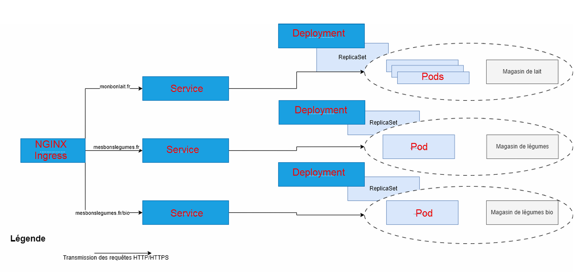

# Kube TP 2 - `Kubernetes Ingress`

## Etape 1. Installer `Kind` et créer votre premier cluster 
Suivre cette documentation : https://kind.sigs.k8s.io/docs/user/quick-start/

# For AMD64 / x86_64
[ $(uname -m) = x86_64 ] && curl -Lo ./kind https://kind.sigs.k8s.io/dl/v0.27.0/kind-linux-amd64

chmod +x ./kind
sudo mv ./kind /usr/local/bin/kind

## Etape 2.  Installer le Nginx ingress Controller 
Suivre cette documentation : https://kind.sigs.k8s.io/docs/user/ingress/#ingress-nginx 

- Créer un cluster dans kind :
```bash
cat <<EOF | kind create cluster --config=-
kind: Cluster
apiVersion: kind.x-k8s.io/v1alpha4
nodes:
- role: control-plane
  extraPortMappings:
  - containerPort: 80
    hostPort: 80
    protocol: TCP
  - containerPort: 443
    hostPort: 443
    protocol: TCP
EOF
```
- `cat <<EOF ... EOF` → C’est une commande Bash qui crée un fichier temporaire contenant la configuration.
- `kind create cluster --config=-` →
    - `kind create cluster` → Crée un cluster Kubernetes dans Docker avec Kind.
    - `--config=-` → Charge la configuration directement depuis stdin (entrée standard) au lieu d'un fichier.
- `kind: Cluster` → Spécifie que nous créons un cluster Kind.
- `apiVersion: kind.x-k8s.io/v1alpha4` → Version de l'API utilisée pour définir le cluster.
- `nodes:` → Définit les nœuds du cluster.
- `role: control-plane` → Ce nœud joue le rôle de control-plane (maître du cluster).
📌 Kind crée un cluster "single-node" où ce nœud gère tout (master + worker).

- `extraPortMappings:` → Cette section mappe les ports du conteneur Docker du cluster vers l’hôte (localhost).
- `containerPort: 80 `→ Le port 80 dans le conteneur Kind (Ingress) sera exposé.
- `hostPort: 80` → Ce port sera redirigé vers le port 80 de la machine hôte.
- `protocol: TCP` → Protocole utilisé (TCP).
📌 Pourquoi cette configuration ?
Permet d’accéder aux sites (`monbonlait.fr`,` mesbonslegumes.fr`) via localhost sans préciser de port spécifique (`http://monbonlait.fr` au lieu de` http://localhost:port`).

## Etape 3. Compléter le schéma avec des objets Kubernetes
